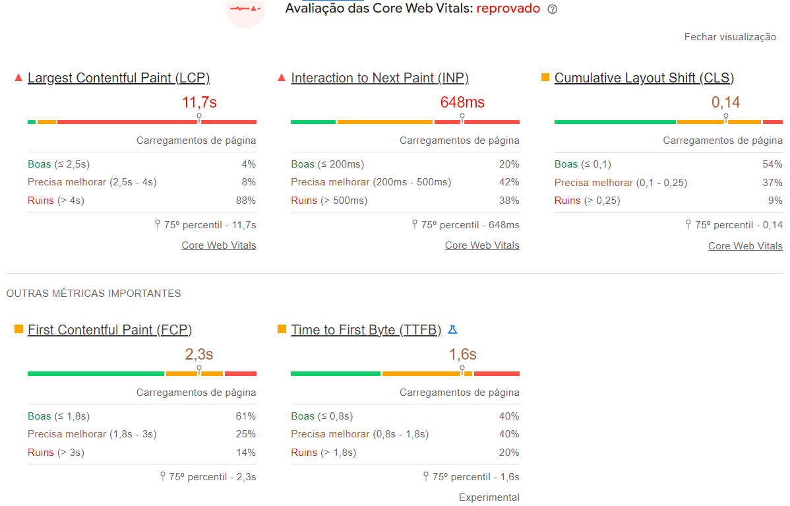
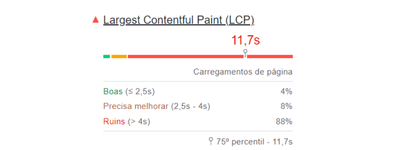
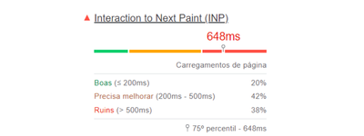
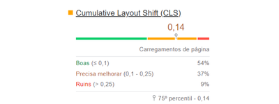
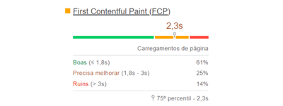
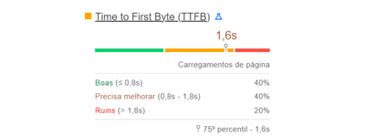
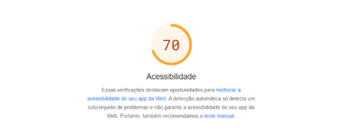
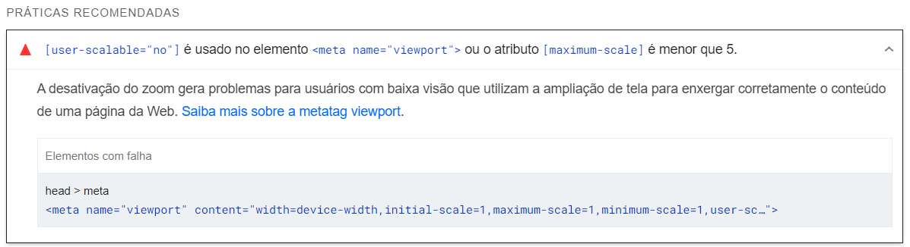
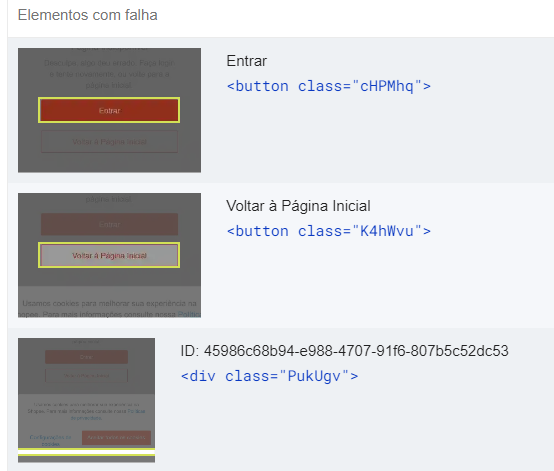
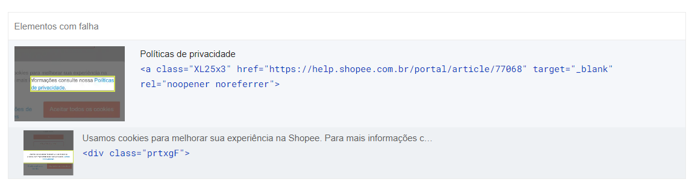

# Avaliação de UX
## Etapa 1 - Ferramenta Ligthouse

O painel de estatísticas de desempenho do site revela que ele apresenta um desempenho insatisfatório em áreas críticas, como o Largest Contentful Paint (LCP) e o Interaction to Next Paint (INP), com 88% e 38% dos carregamentos de página classificados como "Ruim", respectivamente. O Cumulative Layout Shift (CLS) também mostra resultados preocupantes, com 9% dos carregamentos classificados como "Ruim". Por outro lado, o site demonstra um desempenho aceitável em outras métricas, como o First Contentful Paint (FCP) e o Time to First Byte (TTFB), com 61% e 40% dos carregamentos classificados como "Boas". Em suma, a análise sugere que o site precisa de melhorias em áreas específicas para proporcionar uma experiência de usuário mais rápida e estável.

 

A imagem apresenta uma análise de desempenho de uma página web do site 'Shopee', especificamente a métrica de Largest Contentful Paint (LCP).Indicando que o desempenho é ruim, com 88% dos carregamentos de página classificados como "Ruins" (> 4s), 8% como "Precisa melhorar" (2,5s - 4s) e apenas 4% como "Boas" (≤ 2,5s). O tempo de carregamento médio é de 11,7 segundos, o que é considerado alto e pode afetar a experiência do usuário.

A análise de desempenho de uma métrica de interação de uma página web, chamada "Interaction to Next Paint (INP)". Indicando que o desempenho é ruim, com 38% dos carregamentos de página classificados como "Ruins" (> 500ms), 42% como "Precisa melhorar" (200ms - 500ms) e apenas 20% como "Boas" (≤ 200ms). O valor atual de INP é de 648ms, o que é considerado alto e pode afetar a experiência do usuário

A análise de desempenho de uma métrica de layout de uma página web, chamada "Cumulative Layout Shift (CLS)". Indicando que o desempenho é razoável, com 54% dos carregamentos de página classificados como "Boas" (≤ 0,1), 37% como "Precisa melhorar" (0,1 - 0,25) e 9% como "Ruins" (> 0,25). O valor atual de CLS é de 0,14, o que é considerado razoável, mas ainda há espaço para melhoria.

 A análise de desempenho de uma métrica de carregamento de página, chamada "First Contentful Paint (FCP)". Indicando que o desempenho é razoável, com 61% dos carregamentos de página classificados como "Boas" (≤ 1,8s), 25% como "Precisa melhorar" (1,8s - 3s) e 14% como "Ruins" (> 3s). O valor atual de FCP é de 2,3s, o que é considerado razoável, mas ainda há espaço para melhoria.

A análise de desempenho de uma métrica de tempo de resposta do servidor, chamada "Time to First Byte (TTFB)". Indicando que o desempenho é razoável, com 40% dos carregamentos de página classificados como "Boas" (≤ 0,8s), 40% como "Precisa melhorar" (0,8s - 1,8s) e 20% como "Ruins" (> 1,8s). O valor atual de TTFB é de 1,6s, o que é considerado razoável, mas ainda há espaço para melhoria.

 Para acessibilidade em UX, uma métrica comum é a pontuação de acessibilidade, que varia de 0 a 100. Um valor aceitável geralmente é considerado: 80% ou mais: Indica uma boa acessibilidade, com a maioria das diretrizes atendidas. 70% a 79%: Um nível aceitável, mas com espaço para melhorias. Abaixo de 70%: Requer atenção significativa e ajustes para atender a padrões adequados de acessibilidade.
Uma pontuação de 70% é um ponto de partida razoável, mas sugere que há espaço para melhorias. Algumas ações que pode ser considerada para aumentar essa pontuação são: Revisar Texto Alternativo, Contraste de Cores e Navegação por Teclado

 E a ferramenta ligthouse gera umas resalvas e recomenações: 

O uso de [user-scalable="no"] no <meta name="viewport"> ou um [maximum-scale] menor que 5 dificulta a leitura para usuários com baixa visão, que precisam aumentar o zoom. A tag <meta name="viewport" content="width=device-width, initial-scale=1, maximum-scale=1, minimum-scale=1, user-scalable=no"> exemplifica essa falha. Ajustar essa configuração é crucial para melhorar a acessibilidade.

As cores de primeiro e segundo plano não têm uma taxa de contraste suficiente. Para muitos usuários, é difícil ou impossível ler textos com baixo contraste. 

 Os links dependem da cor para serem distinguíveis.
Para muitos usuários, é difícil ou impossível ler textos com baixo contraste. Textos de link perceptíveis melhoram a experiência dos usuários com baixa visão. 
