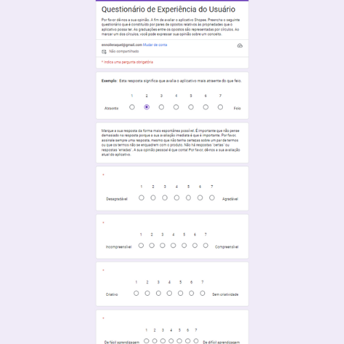

# Avaliação de UX
## Etapa 2 - Ferramenta User Experience Questionnaire (UEQ)

### Aplicação do Questionário UEQ

Para a avaliação da experiência do usuário, baixei o formulário e a planilha de dados disponibilizados pelo instrumento de avaliação utilizado para medir a experiência do usuário, User Experience Questionnaire (UEQ). Ele consiste em um questionário que coleta dados sobre diferentes aspectos da experiência do usuário, como atratividade, clareza, eficiência e confiabilidade. Os resultados podem ser analisados para identificar pontos fortes e áreas de melhoria em produtos ou serviços. .
 

 Arquivos diponibilizados sao esses da imagem, baixei o Questionario. 
 

E as planilhas de dados que deveriam ser avaliados: 
 
 

Apliquei o questionário utilizando o Google Forms [Formulario UEQ](https://docs.google.com/forms/d/1TVi5G674cU69GedvIlD2Oq9VpMvKLa4t3UNQtqa258c/edit) 
 
  O que facilitou a coleta de respostas do grupo de usuários. 

### Analise

Após a aplicação, realizei a análise dos dados obtidos, inserindo as informações coletadas na planilha oferecida pela plataforma UEQ. Essa abordagem permitiu uma análise estruturada dos resultados, contribuindo para a compreensão da percepção dos usuários em relação ao site da Shopee.

  
As médias das escalas do UEQ não produzem uma pontuação geral; para isso, usa-se a extensão KPI. Valores dos itens ajudam a identificar outliers e a interpretar avaliações. 
Valores entre -0,8 e 0,8 são neutros, > 0,8 são positivos e < -0,8 são negativos. As escalas variam de -3 a +3, mas, na prática, valores extremos são raros.
Um valor de +1,5 pode não parecer tão positivo. Utilize a escala reduzida de -2 a +2 ao comunicar resultados para facilitar a interpretação.

 

As escalas do UEQ podem ser agrupadas em qualidade pragmática (Perspicuidade, Eficiência, Confiabilidade) e qualidade hedônica (Estimulação, Originalidade). A qualidade pragmática descreve aspectos de qualidade relacionados a tarefas, enquanto a qualidade hedônica se refere a aspectos não relacionados a tarefas. A seguir, é calculada a média dos três aspectos de qualidade pragmática e dos dois aspectos de qualidade hedônica.
As médias de transparência(Itens 2, 4, 13, 21) variam de 1,4 a 1,8, indicando que a maioria dos participantes considera o conteúdo compreensível e fácil de aprender. O item 2, com média de 1,8, é especialmente positivo, enquanto o item 13, com média de 1,5, sugere que alguns aspectos ainda são vistos como complicados.

Os itens de controle(8, 11, 17, 19) apresentam médias variadas; o item 19, com média de 1,7, mostra que a maioria sente que suas expectativas são atendidas. No entanto, o item 8, com média de 0,6, indica que o produto é percebido como imprevisível.

A média dos itens de eficiência(9, 20, 22, 23) varia de 1,2 a 1,9, sugerindo uma avaliação positiva, especialmente para o item 22, que tem média de 1,9 e é visto como prático. Por outro lado, o item 20, com média de 1,7, aponta para uma percepção de ineficiência que pode ser preocupante. 
Com isso temos:
- Polarização nas Avaliações: Os dados mostram que alguns itens apresentam polarização, especialmente na categoria de inovação. Isso pode indicar que certas características são percebidas como positivas por um grupo de participantes e negativas por outro.
- Aspectos Positivos e Negativos: Embora muitos itens tenham médias acima de 1,0, o número de itens com médias mais baixas indica áreas onde melhorias são necessárias, especialmente na inovação e na estimulação.
- Recomendações: É crucial abordar os pontos negativos, especialmente na inovação e na experiência geral do usuário, para melhorar a percepção do produto.

